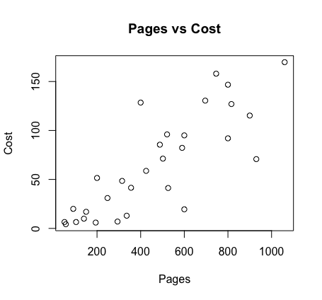
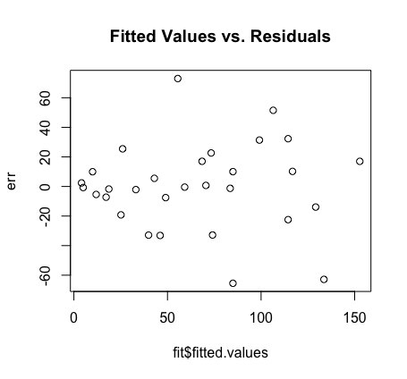
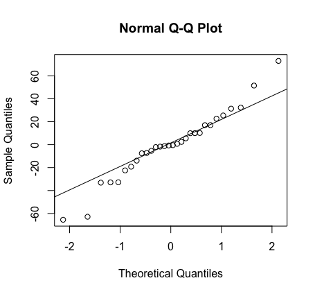
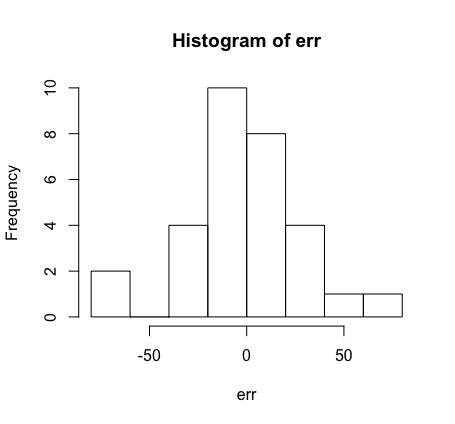

# linear-assumptions

An [R script](linear-assumptions.R) for checking the assumptions required for linear regression. This example uses a simple linear regression model which uses the number of pages of a textbook to predict the cost of a textbook.

#### Investigate relationship: Is linear regression appropriate?

	plot(pg, ct, xlab = "Pages", ylab = "Cost", main = "Pages vs Cost")

 There appears to be a positive linear association between the two variables. A linear regression model is appropriate.

#### After fitting a model, plot the residuals versus fitted values to check the linearity and constant variance assumptions.

	#Determine Equation for Regression Line
	fit = lm(Price~Pages, data = TextPrices)
	summary(fit)

	#Plot residuals vs X
	err = resid(fit)
	plot(pg, err, main = "X vs. Residuals")

 The points appear to be randomly varied above and below zero, with relatively constant width. It is safe to assume linearity for this model. There could be some issue with constant variance assumption because the errors are smaller on the left. This can be fixed by applying a log transformation to the response variable.

#### Create QQ plot of the residuals to assess normality.

	##QQ Plot
	qqnorm(err)
	qqline(err)

The only deviation of the line comes from the tails, therefore the normality assumption appears to be met.

#### Use a histogram of residuals to assess normality.

	#stem and leaf and histogram
	stem(err)
	hist(err)

The shape of this histogram is roughly bell-shaped demonstrating that the normality assumption is met.

#### Outliers

It is also worth noting there is a book with 400 pages and a cost of $128.50 that is an outlier in this data set. This could be due to a mistake in data collection, the value belonging to a different population (i.e. a science textbook instead of a history textbook), or natural variability in the price of textbooks.
